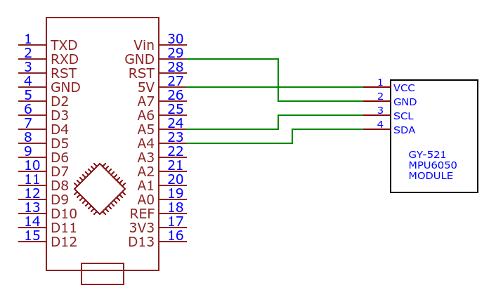

# About

This firmware is supposed to be used for Intertial measuremenet unit (IMU) that can be used for visual-inertial SLAM algorithms, e.g. [Basalt](https://gitlab.com/VladyslavUsenko/basalt).

IMU is based on module GY-521 with popular sensor [MPU-6050](https://invensense.tdk.com/wp-content/uploads/2015/02/MPU-6000-Datasheet1.pdf) which includes 3-axes accelerometer and 3-axes gyroscope. It can be connected to compact [Arduino Nano](https://en.wikipedia.org/wiki/Arduino_Nano) with ATmega328P microcontroller. 

Firmware uses libraries [I2C Device Library](https://www.i2cdevlib.com/usage) and TimerOne. First one is included into this repository, the second one should be installed in Arduino IDE. 

I2C Device Library is used to configure and read sensor via [I2C interface](https://uk.wikipedia.org/wiki/I%C2%B2C). High IMU rate is required for visual inertial SLAM algorithms. That's why MPU-6050 is configured to work on 200 Hz. Gyroscope is used as a clock reference and works in range ±250 °/sec, while accelerometer range is ±2g.

TimerOne library is used for timer interrupts which occur at 200 Hz. Data that have been read is immediately sent via USB serial interface with 115200 baud.

Each 10th reading square wave is formed on digital output D3 of Arduino Nano providing frequency of 20 Hz. This signal is supposed to be used as an external trigger for camera to synchronize one or more cameras with IMU.

Gyroscope and accelerometer values have constant offsets that are different for each sensor and therefore it needs calibration. I2C Device Library has functions for automatic calibration of sensor and [examples of their usage](https://github.com/jrowberg/i2cdevlib/blob/master/Arduino/MPU6050). During calibration series of readings from MPU-6050 are done while it is standing still. After calibration offsets should be updated in firmware code directly.

